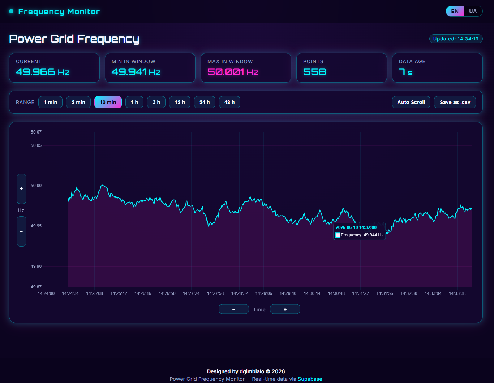
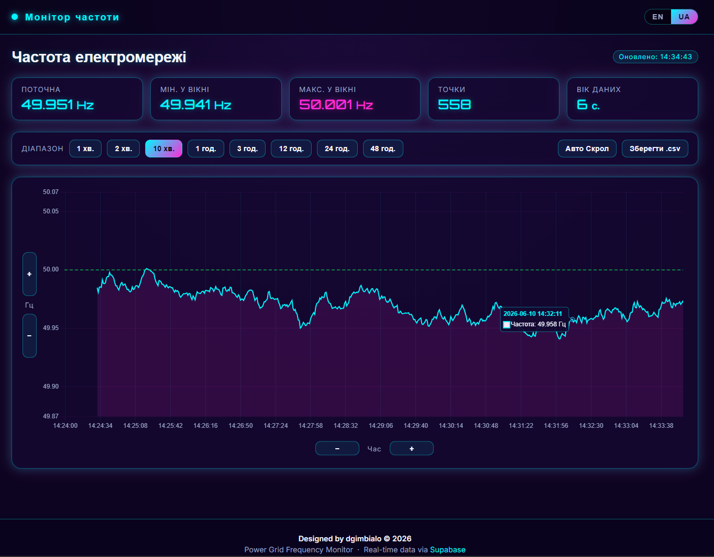
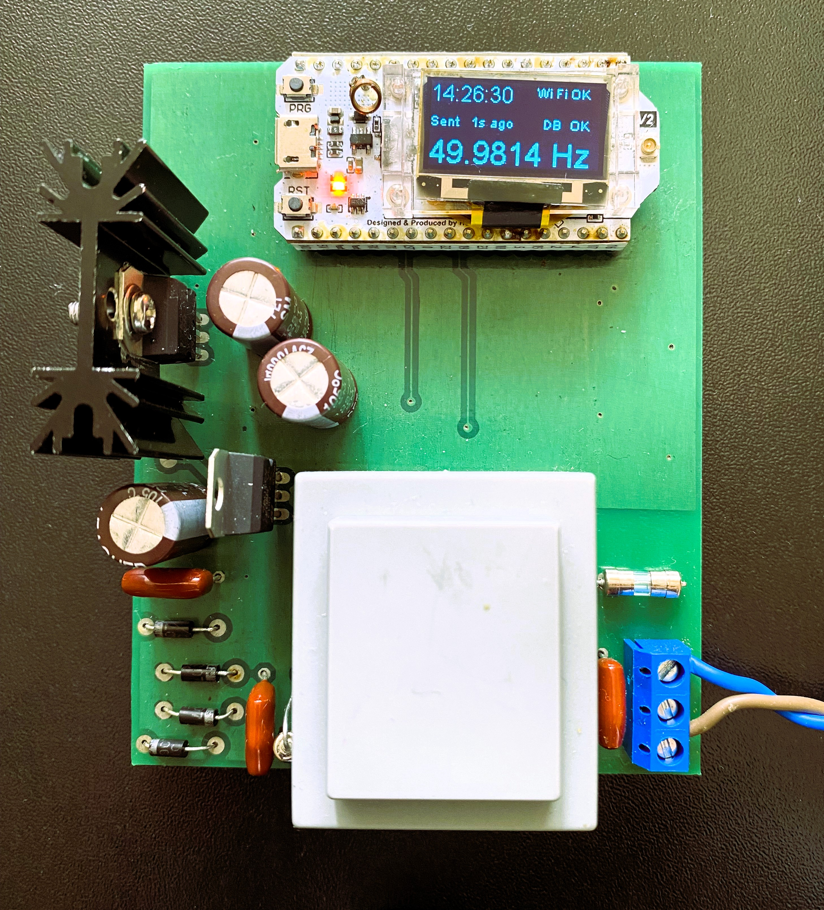

<p align="center">
  
</p>
<p align="center">
  
</p>

<h1 align="center">⚡ Power Grid Frequency Monitor</h1>

<p align="center">
  Real-time power grid frequency dashboard — ESP32 → Supabase → GitHub Pages
</p>

<p align="center">
  
  
  
  
  
  
  
</p>

---

## 🔗 Related Project

<p align="center">
  <a href="https://github.com/dgimbialo/CrossZeroDetector">
    
  </a>
</p>

| Repo | Description |
|---|---|
| [FrequencyCounter ESP32](https://github.com/dgimbialo/CrossZeroDetector) | ESP32 firmware — zero-crossing meter that writes data to the same Supabase table |

---

## 📖 About

A fully **serverless** real-time monitoring dashboard that visualises Ukrainian power grid frequency (nominal **50 Hz**). An ESP32 microcontroller measures zero-crossing frequency every second, sends measurements directly to **Supabase** over Wi-Fi, and the browser reads from Supabase via the REST API — **no Flask, no server, no backend code**.

Hosted for free on **GitHub Pages** as a pure static site.

---

## ✨ Features

| Feature | Details |
|---|---|
| 📡 Real-time polling | Fetches new points every **2 s** |
| 🎞️ Smart drip queue | Live mode: 1 point/s animation · Backlog: instant flush |
| 🔍 Zoom & Pan | Mouse wheel, pinch-to-zoom, drag to pan |
| 📏 Range buttons | 1 min · 2 min · 10 min · 1 h · 3 h · 12 h · 24 h · 48 h |
| 🟢 Nominal line | Dashed green line at exactly 50.000 Hz |
| ⛔ Gap detection | Breaks in line when no data for > 12 s |
| 🕰️ Data Age | Shows `Xs` / `X:YY min` format; turns red when > 2 min old |
| 🌐 i18n | English / Ukrainian — full UI translation incl. units |
| 💾 CSV export | Download all visible data as `.csv` |
| 📱 Responsive | Optimised for mobile & desktop |
| 🔒 Security headers | CSP · X-Content-Type-Options · Referrer-Policy |
| 📦 PWA | Installable as a standalone app (`site.webmanifest`) |

---

## 🏗️ Architecture

```
┌──────────────────────┐        HTTPS / REST         ┌─────────────────────┐
│   ESP32 (firmware)   │  ──── INSERT every 5 s ───► │  Supabase (cloud)   │
│  Zero-crossing meter │                             │  PostgreSQL + RLS   │
│  NTP timestamps      │                             │  table: frequency_  │
│  service_role key    │                             │         log         │
└──────────────────────┘                             └─────────┬───────────┘

                                                    GET /rest/v1/frequency_log
                                                      anon (publishable) key
                                                                │
                                                      ┌─────────▼───────────┐
                                                      │   GitHub Pages      │
                                                      │   (static site)     │
                                                      │   index.html        │
                                                      │   assets/js/*.js    │
                                                      │   Chart.js          │
                                                      └─────────────────────┘
```

**Key security rule:**  
`SUPABASE_ANON` (publishable key) — read-only via Row Level Security — safe to commit.  
`SUPABASE_SERVICE_ROLE` key — **ESP32 firmware only**, never in frontend.

---

## 📁 Project Structure

```
webHz.github.io/
│
├── index.html                  # Single-page app — semantic HTML, no inline JS/CSS
├── site.webmanifest            # PWA manifest (theme, icons, display mode)
├── robots.txt                  # Allow all crawlers
├── .gitignore
│
├── .well-known/
│   └── security.txt            # RFC 9116 security contact
│
├── assets/
│   ├── css/
│   │   └── style.css           # All styles — cyberpunk theme, responsive, animations
│   └── js/
│       ├── config.js           # Supabase URL + anon key (load order: 1st)
│       ├── i18n.js             # EN / UA translation strings (load order: 2nd)
│       ├── api.js              # Pure data layer — sbFetchRecent / sbFetchNew (3rd)
│       └── app.js              # State, Chart.js, drip queue, events, boot (4th)
│
└── foto/
    ├── Foto_1.png              # Desktop screenshot
    └── Foto_2.png              # Mobile screenshot
```

> **Script load order matters** — each file depends on globals from the previous one.  
> All scripts use `defer` so they execute after DOM is parsed, in declaration order.

---

## 🛠️ Tech Stack

### Frontend
| Technology | Version | Purpose |
|---|---|---|
| HTML5 | — | Semantic markup, ARIA attributes |
| CSS3 | — | Custom properties, Grid, Flexbox, `@media` queries |
| Vanilla JS (ES2020) | — | No framework, no build step |
| [Chart.js](https://www.chartjs.org/) | 4.4.0 | Time-series line chart |
| [chartjs-adapter-date-fns](https://github.com/chartjs/chartjs-adapter-date-fns) | 3.0.0 | Date/time axis formatting |
| [chartjs-plugin-zoom](https://github.com/chartjs/chartjs-plugin-zoom) | 2.0.1 | Wheel zoom + pinch |
| [Orbitron](https://fonts.google.com/specimen/Orbitron) | Google Fonts | Numeric display font |
| [Inter](https://fonts.google.com/specimen/Inter) | Google Fonts | UI text (Cyrillic support) |

### Backend / Infrastructure
| Technology | Purpose |
|---|---|
| [Supabase](https://supabase.com) | Hosted PostgreSQL + REST API + Row Level Security |
| [GitHub Pages](https://pages.github.com) | Static site hosting (free, CDN, HTTPS) |

### Firmware (separate repo)
| Technology | Purpose |
|---|---|
| ESP32 / Heltec WiFi LoRa 32 V2 | Microcontroller |
| PlatformIO | Build system |
| ArduinoJson | JSON payload serialisation |
| NTPClient | ISO 8601 timestamps with Kyiv UTC offset |
| FreeRTOS tasks | Parallel measurement + HTTP sending |

---

## 📊 Chart Features

- **Null injection** for gaps > 12 s → visible breaks instead of connecting lines  
- **Nominal line** custom `afterDraw` plugin — always includes 50 Hz in Y viewport  
- **Viewport anchoring** — when data is live: scrolls to `Date.now()`; when historical: anchors to last data point  
- **Auto Y-scale** always keeps 50 Hz line visible via `Math.min(...ys, 50)` / `Math.max(...ys, 50)`

---

## 🔒 Security

| Mechanism | Implementation |
|---|---|
| Content Security Policy | `<meta http-equiv="Content-Security-Policy">` — restricts scripts, styles, fonts, connections |
| X-Content-Type-Options | `nosniff` — prevents MIME-type sniffing |
| Referrer-Policy | `strict-origin-when-cross-origin` |
| Supabase RLS | Browser uses anon key with read-only Row Level Security policy |
| Key separation | `service_role` key lives only in ESP32 firmware — never in frontend |
| security.txt | `.well-known/security.txt` per RFC 9116 |

---

## 🚀 Local Development

```bash
# Clone
git clone https://github.com/dgimbialo/webHz.github.io.git
cd webHz.github.io

# Run local server (Supabase blocks file:// origins)
python -m http.server 8080

# Open in browser
http://localhost:8080
```

> ⚠️ Opening `index.html` directly (`file://`) will fail — Supabase CORS blocks null origin.  
> Always use a local HTTP server.

---

## 🌐 Deployment

Push to the `main` branch of a repository named `<username>.github.io` — GitHub Pages serves it automatically at `https://<username>.github.io`.

No build step, no CI pipeline, no dependencies to install.

---

## 📡 Supabase Table Schema

```sql
CREATE TABLE frequency_log (
    id          bigserial PRIMARY KEY,
    timestamp   timestamptz NOT NULL,
    frequency   numeric(8, 4) NOT NULL
);

-- Read-only access for the browser (anon key)
CREATE POLICY "public read"
    ON frequency_log FOR SELECT
    USING (true);
```

---

## 📝 License

© 2026 **dgimbialo**. All rights reserved.
