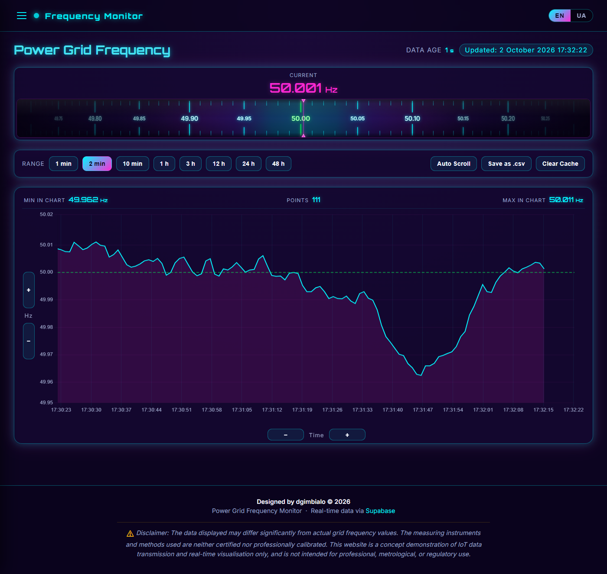
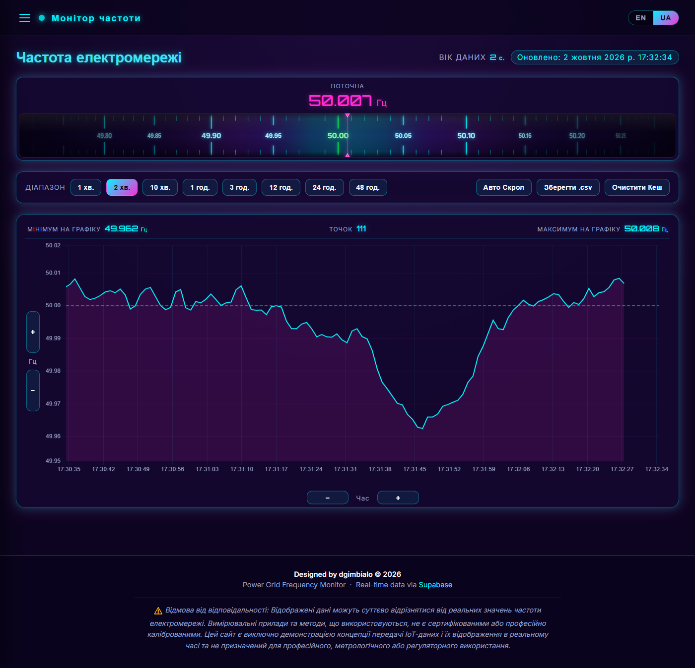
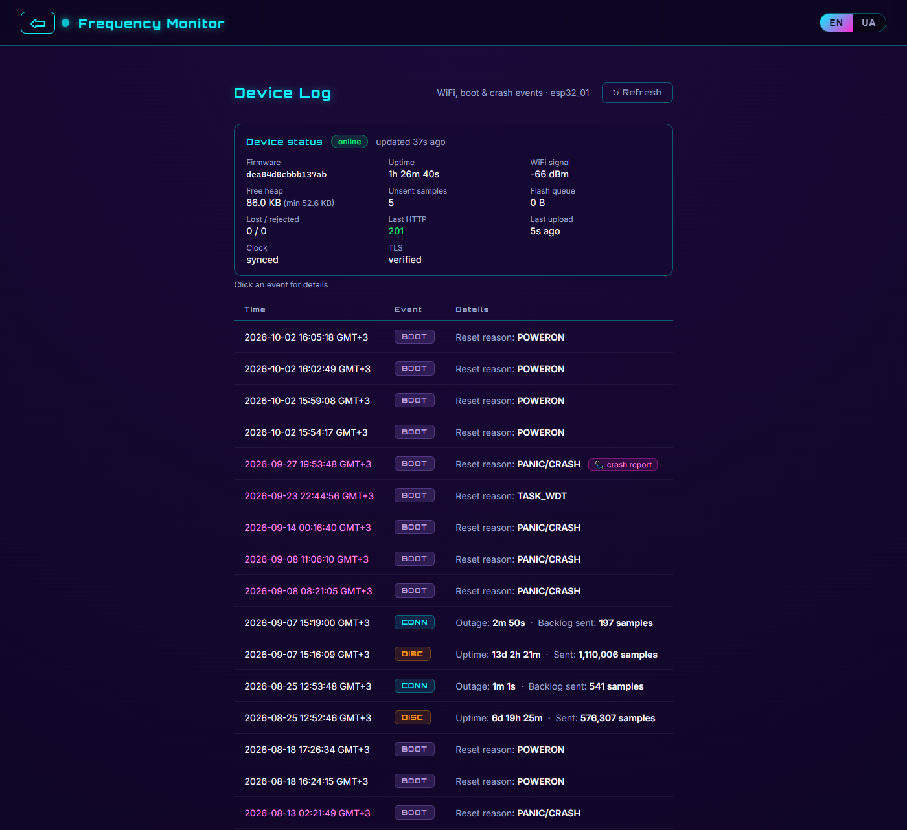
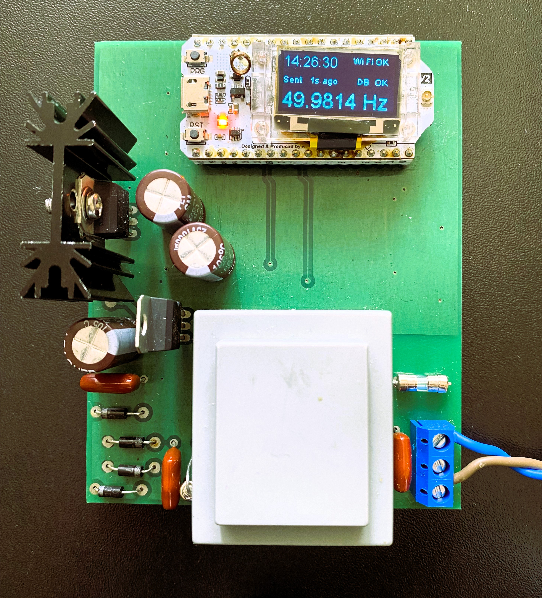

<p align="center">
  
</p>
<p align="center">
  
</p>
<p align="center">
  
</p>

<h1 align="center">⚡ Power Grid Frequency Monitor</h1>

<p align="center">
  Real-time power grid frequency dashboard — ESP32 → Supabase → GitHub Pages
</p>

<p align="center">
  
  
  
  
  
  
  
</p>

---

## 🔗 Related Project

<p align="center">
  <a href="https://github.com/dgimbialo/FrequencyCounter_ESP32">
    
  </a>
</p>

| Repo | Description |
|---|---|
| [FrequencyCounter_ESP32](https://github.com/dgimbialo/FrequencyCounter_ESP32) | ESP32 firmware: zero-crossing meter that writes measurements, its WiFi log, device status and crash reports to the same Supabase project |

---

## 📖 About

A fully **serverless** real-time dashboard for the Ukrainian power grid frequency (nominal **50 Hz**). An ESP32 measures the frequency by zero-crossing about once per second and sends the readings to **Supabase** over Wi-Fi; the browser reads them straight from Supabase via the REST API. **No server, no backend code.**

Two pages:

- **Main page** (`index.html`): live frequency on an analog drum scale, chart with zoom/pan and up to 48 h of history.
- **Device log** (`device-log.html`): WiFi / boot events of the meter, its live health status and crash reports with decoded details.

Hosted for free on **GitHub Pages**: <https://dgimbialo.github.io/webHz/>

---

## ✨ Features

| Feature | Details |
|---|---|
| 📡 Real-time polling | Fetches new points every **2 s** |
| 🎞️ Smart drip queue | Live mode: 1 point/s animation · Backlog: instant flush |
| 🎚️ Drum scale | Analog meter drum: neon-lit scale on a rotating cylinder, damped spring motion, green 50.00 Hz mark, current value above the pointers |
| 🔍 Zoom & Pan | Mouse wheel, pinch-to-zoom, drag to pan, ± buttons on both axes |
| 📏 Range buttons | 1 min · 2 min · 10 min · 1 h · 3 h · 12 h · 24 h · 48 h |
| ⏪ History on demand | Older data is fetched from Supabase as you pan or zoom back (up to 48 h) |
| 💽 Local cache | Points are cached in IndexedDB, so a reload shows the chart instantly; **Clear Cache** button |
| 📊 Chart stats | Min / points / max of the data in the chart, shown in the chart header |
| 🟢 Nominal line | Dashed green line at exactly 50.000 Hz |
| ⛔ Gap detection | Breaks in the line when there is no data for > 5 s |
| 🕰️ Data Age | Time since the newest sample (`Xs` / `X:YY min`); turns red when > 2 min old |
| 🩺 Device log | WiFi / boot events, live device status and crash reports; click an event for decoded details |
| 🌐 i18n | English / Ukrainian, full UI translation incl. units and dates; the choice is shared between pages |
| 💾 CSV export | Download the data visible in the chart as `.csv` |
| 📱 Responsive | Optimised for mobile & desktop |
| 🔒 Security headers | CSP · X-Content-Type-Options · Referrer-Policy |
| 📦 PWA | Installable as a standalone app (`site.webmanifest`) |

---

## 🏗️ Architecture

```
┌──────────────────────────┐       HTTPS / REST        ┌───────────────────────┐
│     ESP32 (firmware)     │ ── INSERT every 5 s ────► │   Supabase (cloud)    │
│  zero-crossing meter     │ ── upsert every 60 s ───► │   PostgreSQL + RLS    │
│  SNTP, UTC timestamps    │ ── after a crash ───────► │                       │
│  offline queue on flash  │                           │   frequency_log       │
│  service_role key        │                           │   wifi_event_log      │
└──────────────────────────┘                           │   device_status       │
                                                       │   device_crash_log    │
                                                       └───────────┬───────────┘
                                                                   │
                                                    GET /rest/v1/… (read only)
                                                     anon (publishable) key
                                                                   │
                                                       ┌───────────▼───────────┐
                                                       │  GitHub Pages         │
                                                       │  index.html           │
                                                       │  device-log.html      │
                                                       │  assets/js/*.js       │
                                                       └───────────────────────┘
```

**Key security rule:**
`SUPABASE_ANON` (publishable key) can only read, through Row Level Security policies, so it is safe in the frontend.
The `service_role` key lives **only in the ESP32 firmware**, never in the frontend.

---

## 📁 Project Structure

```
webHz.github.io/
│
├── index.html                  # Main page: drum scale, toolbar, chart (no inline JS/CSS)
├── device-log.html             # Device log page (page-specific styles inline)
├── site.webmanifest            # PWA manifest (theme, icons, display mode)
├── robots.txt                  # Allow all crawlers
├── .gitignore
│
├── .github/workflows/
│   └── deploy.yml              # Publishes the site to GitHub Pages on push to main
│
├── .well-known/
│   └── security.txt            # RFC 9116 security contact
│
├── assets/
│   ├── css/
│   │   └── style.css           # Shared styles: neon theme, responsive layout
│   └── js/
│       ├── config.js           # Supabase URL + anon key (load order: 1st)
│       ├── i18n.js             # EN / UA strings for the main page (2nd)
│       ├── api.js              # Pure data layer: Supabase REST queries (3rd)
│       ├── cache.js            # IndexedDB point cache (4th)
│       ├── app.js              # State, Chart.js, drum scale, drip queue, events, boot (5th)
│       └── device-log.js       # Device log page (own i18n, status card, details dialog)
│
└── foto/
    ├── Foto_1.png              # Main page, English
    ├── Foto_2.png              # Main page, Ukrainian
    ├── Foto_3.png              # Device log, English
    └── Foto_RelatedProject.JPG # Firmware project
```

> **Script load order matters**: each main-page script depends on globals from the previous one.
> All scripts use `defer`, so they run after the DOM is parsed, in declaration order.

---

## 🛠️ Tech Stack

### Frontend
| Technology | Version | Purpose |
|---|---|---|
| HTML5 | | Semantic markup, ARIA attributes, `<dialog>` |
| CSS3 | | Custom properties, Grid, Flexbox, `@media` queries |
| Vanilla JS (ES2020) | | No framework, no build step |
| Canvas 2D | | Drum scale rendering |
| IndexedDB | | Local point cache |
| [Chart.js](https://www.chartjs.org/) | 4.4.0 | Time-series line chart |
| [chartjs-adapter-date-fns](https://github.com/chartjs/chartjs-adapter-date-fns) | 3.0.0 | Date/time axis formatting |
| [chartjs-plugin-zoom](https://github.com/chartjs/chartjs-plugin-zoom) | 2.0.1 | Wheel zoom + pinch |
| [Orbitron](https://fonts.google.com/specimen/Orbitron) | Google Fonts | Numeric display font |
| [Inter](https://fonts.google.com/specimen/Inter) | Google Fonts | UI text (Cyrillic support) |

### Backend / Infrastructure
| Technology | Purpose |
|---|---|
| [Supabase](https://supabase.com) | Hosted PostgreSQL + REST API + Row Level Security, `pg_cron` cleanup |
| [GitHub Pages](https://pages.github.com) + GitHub Actions | Static hosting (free, CDN, HTTPS), deploy on push |

### Firmware ([separate repo](https://github.com/dgimbialo/FrequencyCounter_ESP32))
| Technology | Purpose |
|---|---|
| ESP32 / Heltec WiFi LoRa 32 V2 | Microcontroller (8 MB flash) |
| PlatformIO, Arduino core on FreeRTOS | Build system, separate tasks for sampling, upload, storage, UI |
| ESP-IDF SNTP | UTC timestamps; bogus NTP replies rejected |
| LittleFS | Offline queue on flash (~3 days), survives reboots |
| WiFiClientSecure + HTTPClient | Keep-alive HTTPS with pinned root certificates |
| ESP-IDF core dump | Crash reports sent to `device_crash_log` |

---

## 📊 Chart Features

- **Null injection** for gaps > 5 s: visible breaks instead of lines across missing data
- **Nominal line**: custom `afterDraw` plugin draws the dashed 50 Hz line
- **Viewport anchoring**: live data scrolls with `Date.now()`; after a manual pan the view stays where you left it until **Auto Scroll**
- **Auto Y-scale**: always keeps 50 Hz in view (the range starts from 50 and widens to the data, with 20% padding)
- **History on demand**: panning past the loaded data fetches the missing range (IndexedDB first, then Supabase), with a progress overlay

---

## 🔒 Security

| Mechanism | Implementation |
|---|---|
| Content Security Policy | `<meta http-equiv="Content-Security-Policy">`: restricts scripts, styles, fonts, connections |
| X-Content-Type-Options | `nosniff`: prevents MIME-type sniffing |
| Referrer-Policy | `strict-origin-when-cross-origin` |
| Supabase RLS | The browser uses the anon key with read-only `SELECT` policies on every table it reads |
| Key separation | The `service_role` key lives only in the ESP32 firmware, never in the frontend |
| Output escaping | Values from the database are HTML-escaped before rendering on the device log page |
| security.txt | `.well-known/security.txt` per RFC 9116 |

---

## 🚀 Local Development

```bash
# Clone
git clone https://github.com/dgimbialo/webHz.git
cd webHz

# Run a local server (Supabase blocks file:// origins)
python -m http.server 8080

# Open in a browser
http://localhost:8080
```

> ⚠️ Opening `index.html` directly (`file://`) will fail: Supabase CORS blocks the null origin.
> Always use a local HTTP server.

---

## 🌐 Deployment

A push to `main` runs `.github/workflows/deploy.yml`, which publishes the repository to GitHub Pages at <https://dgimbialo.github.io/webHz/>.

No build step and no dependencies to install. Static assets are referenced with a `?v=` query, so bump it in the HTML after changing CSS/JS to bypass browser caches.

---

## 📡 Supabase Tables

| Table | Written by | Read by |
|---|---|---|
| `frequency_log` | ESP32, every 5 s | Main page |
| `wifi_event_log` | ESP32, when its WiFi/boot log changes | Device log |
| `device_status` | ESP32, every minute (upsert) | Device log |
| `device_crash_log` | ESP32, once after a crash | Device log |

```sql
CREATE TABLE frequency_log (
    id          bigserial PRIMARY KEY,
    timestamp   timestamptz NOT NULL,
    frequency   numeric(8, 4) NOT NULL
);

-- Read-only access for the browser (anon key); the same kind of policy
-- exists on wifi_event_log, device_status and device_crash_log
CREATE POLICY "public read"
    ON frequency_log FOR SELECT
    USING (true);
```

The full setup for the device tables, plus a trigger on `frequency_log` that drops duplicate and future-dated rows, is in [`supabase_setup.sql`](https://github.com/dgimbialo/FrequencyCounter_ESP32/blob/main/supabase_setup.sql) of the firmware repo. Rows older than 20 days are deleted daily by a `pg_cron` job.

---

## 📝 License

© 2026 **dgimbialo**. All rights reserved.
